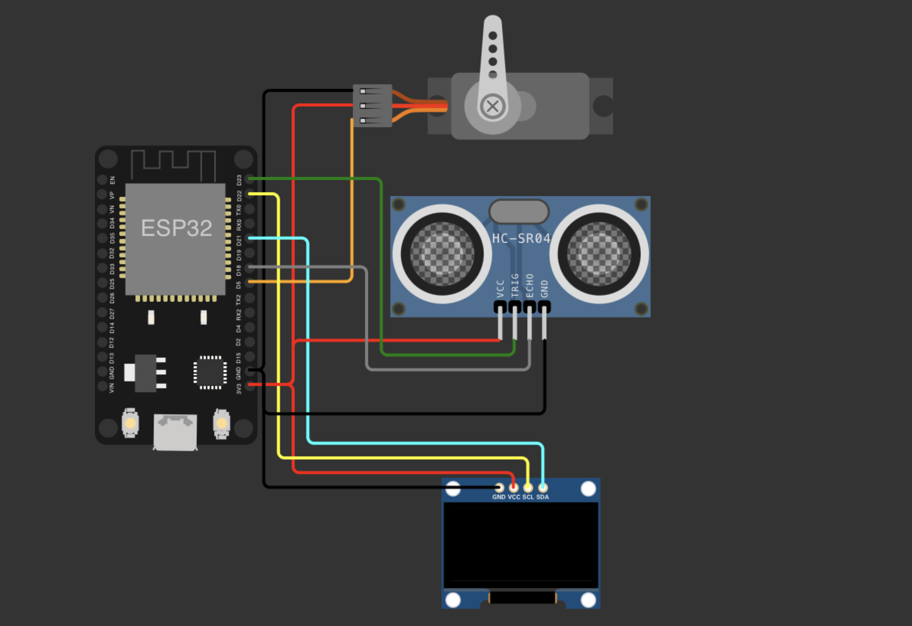
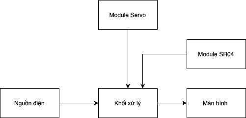

# Radar siêu âm tầm ngắn - Short Range Ultrasonic Radar


## 📝 Mục lục:
[A. Giới thiệu](#I-Giới-thiệu)

[B. Hướng dẫn sử dụng](#II-Hướng-dẫn-sử-dụng)

[C. Danh sách linh kiện](#III-Danh-sách-linh-kiện)

[D. Sơ đồ nguyên lý](#IV-Sơ-đồ-nguyên-lý)

[E. Thiết kế phần mềm](#V-Thiết-kế-phần-mềm)

[F. Tác giả](#VI-Tác-giả)

<a name="I-Giới-thiệu"></a>
## 🏁 A. Giới thiệu
- Đề tài này sử dụng cảm biến siêu âm để đo khoảng cách từ cảm biến đến vật cản trong phạm vi từ 2cm đến 50cm.
- Sư dụng động cơ servo để quét góc 180 độ.
- Khoảng cách đo được sẽ được hiển thị trên màn hình OLED 1.3 inch dưới dạng radar quét ngang.

<a name="II-Hướng-dẫn-sử-dụng"></a>
## 🧾 B. Hướng dẫn sử dụng
Các bước thực hiện:
- Kết nối cảm biến siêu âm với mạch theo sơ đồ nguyên lý.
- Kết nối động cơ servo với mạch theo sơ đồ nguyên lý.
- Kết nối màn hình OLED với mạch theo sơ đồ nguyên lý.
- Nạp code vào mạch.
- Đặt mạch ở một vị trí cố định, không di chuyển.
- Khi có vật cản di chuyển qua cảm biến, màn hình sẽ hiển thị hình ảnh radar quét ngang.

Quy ước chân kết nối:
| Chân siêu âm SR04 | Chân Servo    | Chân OLED    | Chân ESP32 |
| :---:   | :---: | :---: | :---: |
| VCC | VCC   | VCC   | 3.3V |
| Trig |   |  | 23   |
| Echo |   | | 18   |
| GND  | GND   | GND  | GND  |
|       |   | SDA  | 21   |
|       |  | SCK  | 22   |
|       | Data  |  | D5   |

Sơ đồ kết nối:


Hình ảnh mạch thực tế:


Video demo: [Video]()

<a name="III-Danh-sách-linh-kiện"></a>
## 🧰 C. Danh sách linh kiện
1. Cảm biến siêu âm HC-SR04
- Số lượng: 1
- Link mua hàng: [HC-SR04](https://banlinhkien.com/cam-bien-sieu-am-srf04-p6646905.html)
2. Động cơ servo SG90
- Số lượng: 1
- Link mua hàng: [SG90](https://banlinhkien.com/dong-co-servo-sg90-goc-quay-180-p6648774.html)
3. Màn hình OLED 1.3 inch
- Số lượng: 1
- Link mua hàng: [OLED 1.3 inch](https://banlinhkien.com/man-hinh-oled-1.3-128x64-i2c-xanh-oled13i2cb-p12496195.html)
4. Mạch ESP32
- Số lượng: 1
- Link mua hàng: [ESP32](https://banlinhkien.com/kit-wifi-esp32-espwroom32s-p6649289.html)
5. Board test SYB-170
- Số lượng: 1
- Link mua hàng: [Board Test](https://banlinhkien.com/board-test-syb170-170-lo-4.7x3.5cm-p6649612.html)
6. Dây nối
- Số lượng: nhiều
- Link mua hàng: [Dây nối](https://banlinhkien.com/day-nhieu-mau-3p-xh2.54-20cm-p20789741.html)

<a name="IV-Sơ-đồ-nguyên-lý"></a>
## 🚀 D. Sơ đồ nguyên lý
Sơ đồ nguyên lý của đề tài:



<a name="V-Thiết-kế-phần-mềm"></a>
## 💻 E. Thiết kế phần mềm
- Code được viết bằng ngôn ngữ C.
- Sử dụng thư viện `Ultrasonic.h` để đọc dữ liệu từ cảm biến siêu âm.
- Sử dụng thư viện `ESP32Servo.h` để điều khiển động cơ servo.
- Sử dụng thư viện `U8g2lib.h` để điều khiển màn hình OLED.
- Code được chia thành các hàm con như `setup()`, `loop()`, `GetDistance()`.
- Hàm `GetDistance()` sẽ trả về khoảng cách từ cảm biến đến vật cản.
- Hàm `loop()` sẽ quét góc 180 độ của động cơ servo và hiển thị khoảng cách lên màn hình OLED.

Cảm biến siêu âm HC-SR04 sử dụng nguyên lý hoạt động như sau:
- Cảm biến gửi tín hiệu siêu âm ra vật cản thông qua chân `Trig` ở mức thấp trong 2uS trong khoảng 10uS.
- Tín hiệu siêu âm sẽ phản xạ từ vật cản và trở về cảm biến.
- Cảm biến sẽ đọc giá trị trả về qua chân `Echo` với giá trị trong khoản từ 10 - 38 tương ứng với khoảng cách vật lý từ 2cm - 50cm.
```c
// Xác định khoảng cách
int GetDistance() {
  digitalWrite(SR04_TRIG_PIN, LOW);  // Đưa chân Trig xuống mức thấp trong 2uS
  delayMicroseconds(2);
  digitalWrite(SR04_TRIG_PIN, HIGH);  // Gửi luồng siêu âm kéo dài 10uS
  delayMicroseconds(10);
  digitalWrite(SR04_TRIG_PIN, LOW);                          // Tắt luồng siêu âm
  unsigned int microseconds = pulseIn(SR04_ECHO_PIN, HIGH, 30000);  // Đợi cho tới khi có phản hồi, giới hạn thời gian chờ
  return microseconds / 58;                                  // Từ thời gian hành trình tính toán khoảng cách
}
```
Động cơ servo SG90 sử dụng nguyên lý hoạt động như sau:
- Động cơ servo sẽ quét góc từ 0 đến 180 độ.
- Động cơ servo sẽ quét góc theo góc mà chúng ta đã thiết lập trong code.
```c
// Khởi động Servo
  radarServo.attach(SERVO_PIN);
  radarServo.write(angle);
```

Màn hình OLED 1.3 inch sử dụng nguyên lý hoạt động như sau:
- Màn hình OLED sử dụng giao tiếp I2C.
- Màn hình OLED sẽ hiển thị hình ảnh radar quét ngang.
```c
dis = GetDistance();
    Serial.println(dis);

    // Vẽ tia radar
    if (dis >= MAX_DISTANCE) {
      int x = centerX - radius * cos(currentAngle * PI / 180);
      int y = centerY - radius * sin(currentAngle * PI / 180);
      u8g2.drawLine(centerX, centerY, x, y);
    } else {
      int x = centerX - radius * dis * cos(currentAngle * PI / 180) / MAX_DISTANCE;
      int y = centerY - radius * dis * sin(currentAngle * PI / 180) / MAX_DISTANCE;
      u8g2.drawLine(centerX, centerY, x, y);
    }
    u8g2.sendBuffer();
    radarServo.write(currentAngle);
```
Code đầy đủ: [Code](./shortrangeradar.ino)

<a name="VI-Tác-giả"></a>
## ✍️ F. Tác giả
- [Nguyễn Thanh Hà](https://github.com/hantbk) - 20210298
- [Đỗ Thành Đạt](https://github.com/Duongneee) - 20215560
- [Vũ Văn Hảo](https://github.com/vanhao2310) - 20215572
- [Quách Đình Dương](https://github.com/vanhao2310) - 20215558

⭐ If you use the project, please give us a star. Thank you!


