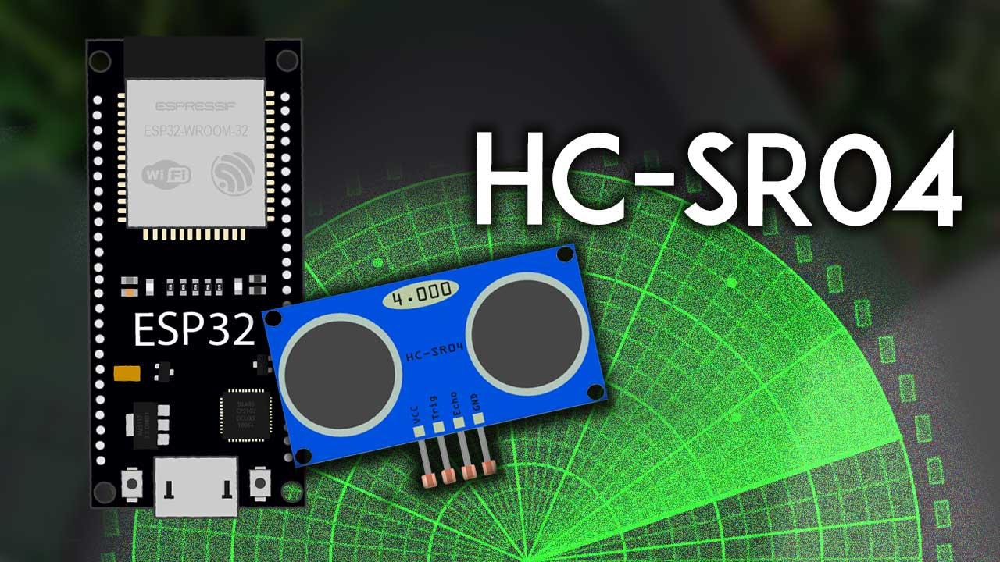
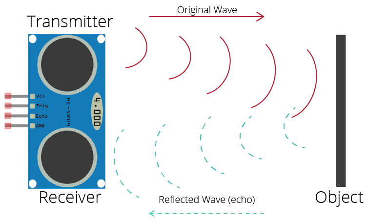
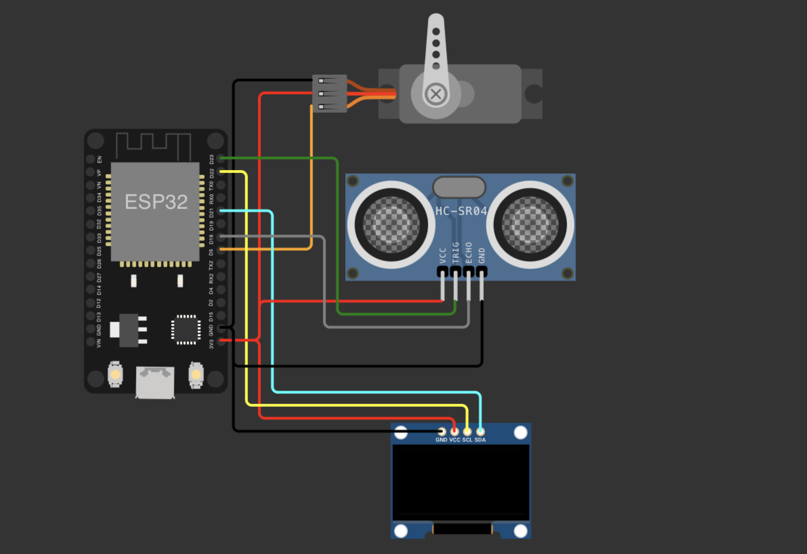
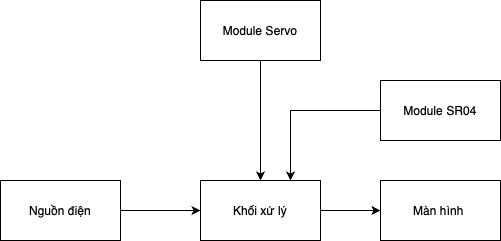

# Short Range Ultrasonic Radar


## 📝 Table of Contents:
[A. Introduction](#I-Introduction)

[B. User Guide](#II-User-Guide)

[C. Component List](#III-Component-List)

[D. Schematic Diagram](#IV-Schematic-Diagram)

[E. Software Design](#V-Software-Design)

[F. Authors](#VI-Authors)

<a name="I-Introduction"></a>
## 🏁 A. Introduction
- This project uses an ultrasonic sensor to measure the distance from the sensor to obstacles within a range of 2cm to 400cm (0.8inch to 157inch) with an accuracy of 0.3cm (0.1inch), which is good for most applications.
- Uses a servo motor to sweep a 180-degree angle.
- The measured distance will be displayed on a 1.3-inch OLED screen in the form of a horizontal scanning radar.
- The project is implemented on the ESP32 board.
- The project is suitable for use in small spaces such as rooms, corridors, etc.

## HC-SR04 Ultrasonic Sensor Technical Data
The following table shows the key features and specs of the HC-SR04 ultrasonic sensor. For more information, you should consult the sensor’s datasheet.

| Feature | Description |
| :---: | :---: |
| Power Supply | 5V DC |
| Working Current | 15mA |
| Working Frequency | 40kHz |
| Maximum Range |  4 meters |
| Minimum Range | 2 cm |
| Mesuring Angle | 15º |
| Resolution | 0.3 cm |
| Trigger Input Signal | 10uS TTL pulse |
| Echo Output Signal | TTL pulse proportional to the distance range |
| Dimensions | 45mm x 20mm x 15mm |

## How Does the HC-SR04 Ultrasonic Sensor Work?
The ultrasonic sensor uses sonar to determine the distance to an object. Here’s how it works:

1. The ultrasound transmitter (trig pin) emits a high-frequency sound (40 kHz).
2. The sound travels through the air. If it finds an object, it bounces back to the module.
3. The ultrasound receiver (echo pin) receives the reflected sound (echo).



Taking into account the sound’s velocity in the air and the travel time (time passed since the transmission and reception of the signal) we can calculate the distance to an object. Here’s the formula:
  
```
distance to an object = ((speed of sound in the air)*time)/2
```
- where: speed of sound in the air at 20ºC (68ºF) = 343m/s


<a name="II-User-Guide"></a>
## 🧾 B. User Guide
Steps to implement:
- Connect the ultrasonic sensor to the circuit according to the schematic diagram.
- Connect the servo motor to the circuit according to the schematic diagram.
- Connect the OLED screen to the circuit according to the schematic diagram.
- Upload the code to the circuit.
- Place the circuit in a fixed position, do not move it.
- When an obstacle moves past the sensor, the screen will display a horizontal scanning radar image.

Pin connection convention:
| SR04 Ultrasonic Pin | Servo Pin    | OLED Pin    | ESP32 Pin |
| :---:   | :---: | :---: | :---: |
| VCC | VCC   | VCC   | 3.3V |
| Trig |   |  | 23   |
| Echo |   | | 18   |
| GND  | GND   | GND  | GND  |
|       |   | SDA  | 21   |
|       |  | SCK  | 22   |
|       | PWM  |  | D5   |

Connection diagram:


Actual image:


Demo video:

https://github.com/DoDat-12/shortrangeradar/assets/89787228/abf60fdb-f4bd-479f-adab-8d7409c9bfb1


<a name="III-Component-List"></a>
## 🧰 C. Component List
1. HC-SR04 Ultrasonic Sensor
- Quantity: 1
- Purchase link: [HC-SR04](https://www.amazon.com/Ultrasonic-Measuring-Transducer-ultrasonic-transducer/dp/B0DDHGRP6C/ref=sr_1_4?crid=1IB3FHUI8M8N3&dib=eyJ2IjoiMSJ9.eXeBKxGwPIAwCcKVzElQv8X3oAAwhxUeCUVdVBFUYNmUlyYLGCS0GYFsrQ2Uvwsxc7-pPrgm9S_HSuKXgtnIbmuIaC99BHFq0Yt4IfO23YlEanGObyIW4m1OSDgjuTBA36VRlU4RzidUacGqamEslIG0vaLTd9TfH7PPJVVuIjGBXAKgB_wi-FgoH06wpKCyEt5FOHXrHfxvAHVU45xF_L2gCXC8Rm0C9H8GxiwZuDw.5cQZdw4xwgxkBOHclAMM5yJXDYtIl_986gtlzTelvt8&dib_tag=se&keywords=hc-sr04+ultrasonic+sensor&qid=1728314856&sprefix=HC-SR04+Ultrasonic+Sensor,aps,1024&sr=8-4)
2. SG90 Servo Motor
- Quantity: 1
- Purchase link: [SG90](https://www.amazon.com/Micro-Helicopter-Airplane-Remote-Control/dp/B072V529YD/ref=sr_1_1?crid=26NMBNLO46FS8&dib=eyJ2IjoiMSJ9.KPXY-1BMD4AoaoJO-RlV6e7C7amAWYjWITcPSXLXG2zRavVbnnPzOpjqZGcwc_7zs0FMRUOqX_6DKNaLZeGLp0lZtcki4KKk8l4bW1FvhkHfEQ1Zfn-Y4UGOIC5UwcoVnWFP1o20XD4xmkAYFpw5qB2VvmoqMVJhLJG5qD3AAR9tvUt1XIYa7VD948GrL0MsH60l4sDy_lnOSuCUZxFcWwYy4rWsmCHwceczUgDiQRTKZTzfqxIEHk7K3EN7FsHT1WqqYAIcMi4fUHEGivJe8-bqkGjNskY85esMS2lynFE.a2QlsUjCq1aRS1bfKfWEo9lCNisCGPLxPD0glniBCdQ&dib_tag=se&keywords=SG90+Servo+Motor&qid=1728315406&sprefix=sg90+servo+motor%2Caps%2C380&sr=8-1)
3. 1.3-inch OLED Screen
- Quantity: 1
- Purchase link: [1.3-inch OLED](https://www.amazon.com/DIYmalls-Display-Screen-Module-128x64/dp/B0CCL88VTG/ref=sr_1_1?crid=DKS7YMJHO96V&dib=eyJ2IjoiMSJ9.oM7nbUfV8fUt1aA3u6HNbF_W5gjCcXVPl5HphE6MNMm0rhyMg8vi4yKagshxzu9jmfenfdVlJDnpuWLYFjU8LANnRDtFQkx7LEtY3JHZJ_K9kkAn5sw4eBCrQlynv2V-D6FohG8pGYmSxQcuI5_Crs_k_4tLh_4Bp1mkfKAG8_lsI7igzmYsZ2gFuMlQcow9bqElZJCmIh2rVIZcmC577QryjVXNiQheFSWWrgySSgM.O7F-4kBFAwl2S14SFISV33xN3B2-AMA-cpzpyHXVGMs&dib_tag=se&keywords=1.3-inch+OLED+Screen&qid=1728314977&sprefix=1.3-inch+oled+screen%2Caps%2C518&sr=8-1)
4. ESP32 Board
- Quantity: 1
- Purchase link: [ESP32](https://www.amazon.com/ESP-WROOM-32-Development-Microcontroller-Integrated-Compatible/dp/B08D5ZD528/ref=sr_1_1?crid=2TRAUGW316QTB&dib=eyJ2IjoiMSJ9.Na5nlliGXytwgT8dOa8kGlXx8Rt9q6wySlhgETYvRAeszt3OtYu80LduyWzHyaKfKpUmWt7-zJbF0gLRxy61Q_QhRoBJEPr92BRRPkI2d4dTjShgDRQkToNpegRs-56rKZEYuvdRpSOiscJx_NmNJFO_uHrJUxRwIT5cVqbt7wslPAddwUalOCpUp6gaxzoK6nfpY_gJnd_iPffcv26rWO1h3LJDuemkNh_Nwqyyz-o.5DC3psoxXOO4yuME3WBP2KKEOsvgs28e0-xPVfLLXuA&dib_tag=se&keywords=esp32+board&qid=1728314997&sprefix=ESP32+Board%2Caps%2C585&sr=8-1)
5. SYB-170 Test Board
- Quantity: 1
- Purchase link: [Test Board](https://www.amazon.com/Aexit-Universal-Tiepoint-Solderless-Breadboard/dp/B07DDBDMQ4/ref=sr_1_2?crid=1GGISP93BAC0D&dib=eyJ2IjoiMSJ9.UlZ49eWCsbbvypv6solRaqBzhUim46joXtChPDTaoKHnqxVWdF-NmQz2qDZ3Jp2U_ghbCjSuw9kXYrOtZ2ZcqIUlciB69P2OeTM6gyqyROQdtWoxHmAJ_T3TwZGMoGGej4r4ukZA2V8ddvx3r8_LW4Gr07LhE0XbJjt16Ko9MG75HWItFDUq-yOMS4dvr-z1NvJSEsrcE4PSgMO6iY7DahNifQEetJKHwnklH170rE8.R1Ukqpb4wd8t_GOvG10aQct_xlwe89hABLcPBB9hMf0&dib_tag=se&keywords=SYB-170+Test+Board&qid=1728315461&sprefix=syb-170+test+board%2Caps%2C577&sr=8-2)
6. Connecting Wires
- Quantity: multiple
- Purchase link: [Connecting Wires](https://www.amazon.com/Preformed-Breadboard-Assorted-Solderless-Prototyping/dp/B07WC3YKGQ/ref=sr_1_9?crid=1EOQB6Q7RQPJK&dib=eyJ2IjoiMSJ9.9coO5iQ14I-rcVuj0bUrBVFPSUAKFh1d1NgQ1NQyWwJ7tyKnE0oKrp5kfVevhkrwcoV6CU8uefDsDt8r865sMy44IA4GeW6cpGUVLJONXx6q584JmpuzfgH8BVMRWoaafTxCcKja7i6CSoE-IFKOZiutt0rcAfmhEuVjIwSaoiooK9QsVDVzkWqhjxcv5AjjcZubVjP8gMqi_E1-1LxN2mweBa7q1i0aNLS0hXU9aQg.m2XSZQE8Az9vj7Z-QbaEUxCzMpkZ8ghKGJkA52uNdbc&dib_tag=se&keywords=Connecting+Wires&qid=1728315072&sprefix=connecting+wires%2Caps%2C546&sr=8-9)

<a name="IV-Schematic-Diagram"></a>
## 🚀 D. Schematic Diagram
Schematic diagram of the project:



<a name="V-Software-Design"></a>
## 💻 E. Software Design
- The code is written in C++.
- Uses the `Ultrasonic.h` library to read data from the ultrasonic sensor.
- Uses the `ESP32Servo.h` library to control the servo motor.
- Uses the `U8g2lib.h` library to control the OLED screen.
- The code is divided into subroutines such as `setup()`, `loop()`, `GetDistance()`.
- The `GetDistance()` function will return the distance from the sensor to the obstacle.
- The `loop()` function will sweep the 180-degree angle of the servo motor and display the distance on the OLED screen.

The HC-SR04 ultrasonic sensor operates on the following principle:
- The sensor sends an ultrasonic signal to the obstacle through the `Trig` pin at a low level for 2uS within 10uS.
- The ultrasonic signal will reflect from the obstacle and return to the sensor.
- The sensor will read the returned value through the `Echo` pin with values ranging from 10 - 38 corresponding to physical distances from 2cm - 50cm.
```c
// Determine distance
int GetDistance() {
digitalWrite(SR04_TRIG_PIN, LOW); // Set Trig pin to low level for 2uS
delayMicroseconds(2);
digitalWrite(SR04_TRIG_PIN, HIGH); // Send ultrasonic wave for 10uS
delayMicroseconds(10);
digitalWrite(SR04_TRIG_PIN, LOW); // Turn off ultrasonic wave
unsigned int microseconds = pulseIn(SR04_ECHO_PIN, HIGH, 30000); // Wait for response, limit waiting time
return microseconds / 58; // Calculate distance from travel time
}
```
The SG90 servo motor operates on the following principle:
- The servo motor will sweep an angle from 0 to 180 degrees.
- The servo motor will sweep the angle according to the angle we have set in the code.
```c
// Initialize Servo
radarServo.attach(SERVO_PIN);
radarServo.write(angle);
```


The 1.3-inch OLED screen operates on the following principle:
- The OLED screen uses I2C communication.
- The OLED screen will display a horizontal scanning radar image.
- The OLED screen will display the distance on the OLED screen.

```c
dis = GetDistance();
    Serial.println(dis);

    // Draw radar line
    if (dis >= MAX_DISTANCE) {
      int x = centerX - radius * cos(currentAngle * PI / 180);
      int y = centerY - radius * sin(currentAngle * PI / 180);
      u8g2.drawLine(centerX, centerY, x, y);
    } else {
      int x = centerX - radius * dis * cos(currentAngle * PI / 180) / MAX_DISTANCE;
      int y = centerY - radius * dis * sin(currentAngle * PI / 180) / MAX_DISTANCE;
      u8g2.drawLine(centerX, centerY, x, y);
    }
    u8g2.sendBuffer();
    radarServo.write(currentAngle);
```
Full code: [Code](./shortrangeradar.ino)

<a name="VI-Authors"></a>
## ✍️ F. Authors
- [Nguyen Thanh Ha](https://github.com/hantbk) - 20210298
- [Do Thanh Dat](https://github.com/DoDat-12) - 20215560
- [Vu Van Hao](https://github.com/vanhao2310) - 20215572
- [Quach Dinh Duong](https://github.com/Duongneee) - 20215558

⭐ If you use the project, please give us a star. Thank you!


